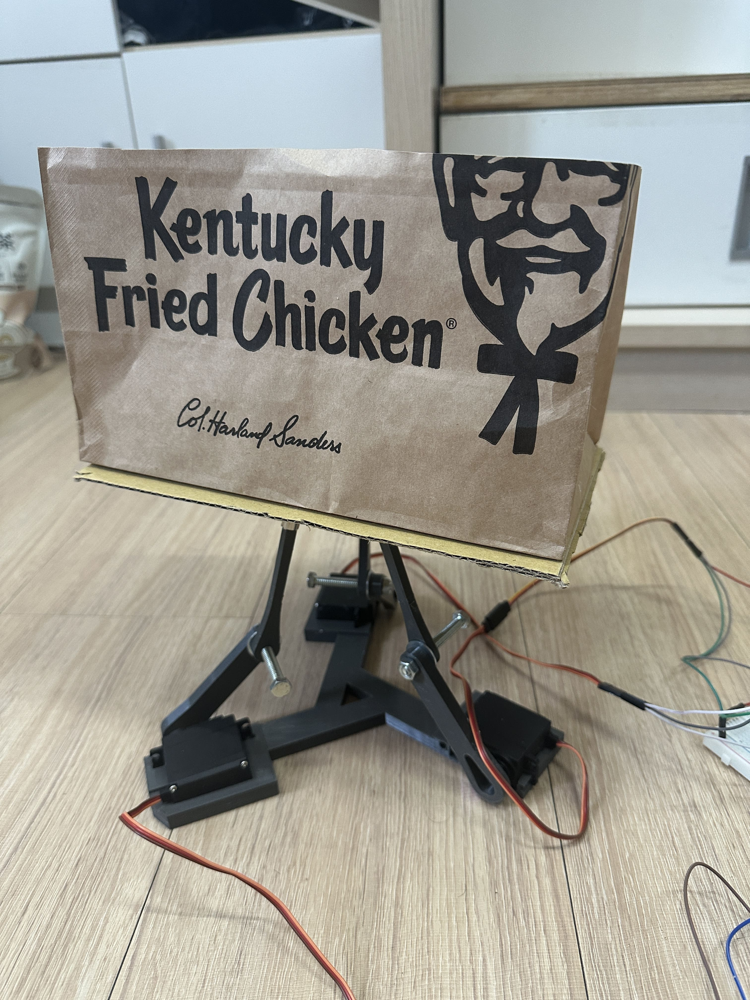

# Intelligent-garbage-can

**by 顏丞瑋**

## Overview
A smart trash can controlled by three motors that tilt the upper platform. A camera observes for object movement, and when detected, the platform tilts to the corresponding angle to drop paper boxes into the trash can.

---

### demo video https://www.youtube.com/shorts/W6vrVf8LZIY

## Hardware
1. Raspberry Pi *1
2. PCA9685 (I2C Interface) *1
3. Camera
4. MG996R Servo Motor *3
5. Machine Arm *3
6. Machine Base *1
7. Several Nuts and Screws
8. 電池組
9. 麵包版

### Software
- **adafruit_servokit**: Used for controlling PCA9685.

---

## Final Product

---

## Assembly Steps

### Step 1: 3D Print the Base and Arms
- Use a 3D printer to fabricate the base and the arms required for the project.
- 請使用crua這個程式對stl檔進行切片 切片完的檔案會叫做gcode，將切片完的檔案使用usb-sd卡轉換器存進sd卡裡 並插入sd印表機就可以開始列印。
- 注意：列印之前要對機器進行預熱 在crua程式裡要對檔案設定正確的印表機型號與材料材質
  (圖都在檔案裡可以下載)

### Step 2: Assemble the Components
將3d列印好的手臂用螺絲組合起來並用螺帽轉到合適的鬆緊度 注意：不要轉太緊不然手臂無法轉動
將mg996r裝入底座

### Step 3: Wiring and Software Setup
1. Wire the PCA9685 to the Raspberry Pi using the I2C interface.
2. Connect the servo motors to the PCA9685.
3. Install the `adafruit_servokit` library on the Raspberry Pi.
4. Write a Python script to control the servo motors based on object detection from the camera. 注意：樹莓派python版本是3.7.3不能使用較新的套件
### Step 4: 樹莓派連接pca9685連接mg996r

---
-使用pinout查詢樹莓派腳位
-PCA9685 與 Raspberry Pi
-PCA9685 的 VCC 跟 Raspberry Pi 的 3.3V 接到麵包版正極
-PCA9685 的 GND 跟 Raspberry Pi 的 GND 連接到麵包版的負極 再接上電池組的負極
-PCA9685 的 SCL 接 Raspberry Pi 的 SCL（GPIO3）
-PCA9685 的 SDA 接 Raspberry Pi 的 SDA（GPIO2）
-PCA9685 與 MG996R
-PCA9685 的任意 PWM 通道（第一顆接PWM0）接 MG996R 的信號線（通常為橙色）
-MG996R 的電源線（紅色）接到麵包版正極 三顆馬達都接在同一個正極
-MG996R 的接地線（棕色）接到麵包版負極

### Step 5: 調整馬達角度
---
使用以下程式碼將馬達角度皆調整到90度，再將手臂用螺絲連接上馬達，此時要朝上連接就是以90度去做連接，這樣可以確保所有馬達角度和手臂角度正確

from flask import Flask, request, jsonify, render_template_string
from adafruit_servokit import ServoKit

kit = ServoKit(channels=16)

servo_1 = 0
servo_2 = 1
servo_3 = 2
servo_angles = {servo_1: 90, servo_2: 90, servo_3: 90}  # 初始角度設為 90

def move_servo(servo_channel, angle):
    """將伺服馬達移動到指定角度"""
    if 0 <= angle <= 180:
        kit.servo[servo_channel].angle = angle
        print(f"Servo {servo_channel} moved to {angle} degrees")
    else:
        print("Invalid angle! Must be between 0 and 180.")

app = Flask(__name__)

@app.route('/')
def index():
    return render_template_string("""
    <!DOCTYPE html>
    <html>
    <head>
        <title>Servo Motor Control</title>
        
    </head>
    <body>
        <h1>Servo Motor Control</h1>

        

            
Servo 0

            <button onclick="updateServo(0, -5)">-</button>
            90°
            <button onclick="updateServo(0, 5)">+</button>
        

        

            
Servo 1

            <button onclick="updateServo(1, -5)">-</button>
            90°
            <button onclick="updateServo(1, 5)">+</button>
        

        

            
Servo 2

            <button onclick="updateServo(2, -5)">-</button>
            90°
            <button onclick="updateServo(2, 5)">+</button>
        

        
    </body>
    </html>
    """)

@app.route('/move', methods=['POST'])
def move():
    data = request.json
    servo = data.get("servo")
    angle = data.get("angle")

    if servo in [servo_1, servo_2, servo_3] and 0 <= angle <= 180:
        servo_angles[servo] = angle
        move_servo(servo, angle)
        return jsonify({"status": "success", "message": f"Servo {servo} moved to {angle} degrees"})
    else:
        return jsonify({"status": "error", "message": "Invalid servo or angle"}), 400

if __name__ == '__main__':
    app.run(host='0.0.0.0', port=5000)

---

運行程式後用http://（你樹莓派的ip）:5000 輸入在網頁上就可以看到剛剛那段程式碼做的網頁了

### Step 6: 連接攝影機
先確保camera有連接上樹莓派
接上來有幾點要確認
1.檢查 CSI 接口的工作狀態 執行以下命令查看相機模組是否被檢測到：
vcgencmd get_camera
輸出應該是：
supported=1 detected=1
若沒有的話使用sudo raspi-config來開啟攝影機，樹莓派要重啟
2.確保cv2套件可正常運作

3.使用以下程式碼確認偵測移動功能 一樣使用http://（你樹莓派的ip）:5000來登入，前一個程式碼要停止才可使用
from flask import Flask, Response, render_template_string
from adafruit_servokit import ServoKit
import cv2
import time

kit = ServoKit(channels=16)
camera = cv2.VideoCapture(0)

servo_1 = 0
servo_2 = 1
servo_3 = 2
servo_angles = {servo_1: 90, servo_2: 90, servo_3: 90}  # 初始角度設為 90

fgbg = cv2.createBackgroundSubtractorMOG2(history=500, varThreshold=25, detectShadows=True)

last_move_time = 0
MOVE_INTERVAL = 5  # 限制間隔時間（秒）

def move_servo(servo_channel, angle):
    """將伺服馬達移動到指定角度"""
    if 0 <= angle <= 180:
        kit.servo[servo_channel].angle = angle
        servo_angles[servo_channel] = angle
        print(f"Servo {servo_channel} moved to {angle} degrees")
    else:
        print("Invalid angle! Must be between 0 and 180.")

def detect_motion(frame):
    """檢測影像中是否有物體移動"""
    # 應用背景減法
    fgmask = fgbg.apply(frame)

    kernel = cv2.getStructuringElement(cv2.MORPH_RECT, (5, 5))
    fgmask = cv2.morphologyEx(fgmask, cv2.MORPH_OPEN, kernel) 
    fgmask = cv2.morphologyEx(fgmask, cv2.MORPH_CLOSE, kernel) 

    contours, _ = cv2.findContours(fgmask, cv2.RETR_EXTERNAL, cv2.CHAIN_APPROX_SIMPLE)

    motion_detected = False

    for contour in contours:

        if cv2.contourArea(contour) > 1000: 
            motion_detected = True
            cv2.drawContours(frame, [contour], -1, (0, 255, 0), 2)

    return motion_detected, frame

def generate_frames():
    """生成攝像頭幀數據，並檢測移動"""
    global last_move_time

    while True:
        success, frame = camera.read()
        if not success:
            break
        else:
            frame = cv2.flip(frame, 0)  # 垂直翻轉

            has_motion, frame = detect_motion(frame)

            current_time = time.time()
            if has_motion and (current_time - last_move_time > MOVE_INTERVAL):
                print("偵測到物體移動，移動伺服馬達。")
                import random
                if random.randint(0, 1) == 0:
                    move_servo(servo_1, 90)
                    move_servo(servo_2, 120)
                    move_servo(servo_3, 90)
                else:
                    move_servo(servo_1, 90)
                    move_servo(servo_2, 90)
                    move_servo(servo_3, 120)
                last_move_time = current_time
                time.sleep(1)  # 移動完成後短暫等待
            elif not has_motion:
                print("無物體移動，將伺服馬達調回 90 度。")
                move_servo(servo_1, 90)
                move_servo(servo_2, 90)
                move_servo(servo_3, 90)

            _, buffer = cv2.imencode('.jpg', frame)
            frame = buffer.tobytes()

            yield (b'--frame\r\n'
                   b'Content-Type: image/jpeg\r\n\r\n' + frame + b'\r\n')

app = Flask(__name__)

@app.route('/video')
def video_feed():
    """視頻流路由"""
    return Response(generate_frames(), mimetype='multipart/x-mixed-replace; boundary=frame')

@app.route('/')
def index():
    """主頁，顯示視頻流"""
    return render_template_string("""
    <!DOCTYPE html>
    <html>
    <head>
        <title>Live Stream and Motion Detection</title>
        
    </head>
    <body>
        
    </body>
    </html>
    """)

if __name__ == '__main__':
    app.run(host='0.0.0.0', port=5000)

---

## Reference Materials
- https://github.com/oohyuti/IoT-Project
- https://github.com/nicohmje/PID-ballonplate

